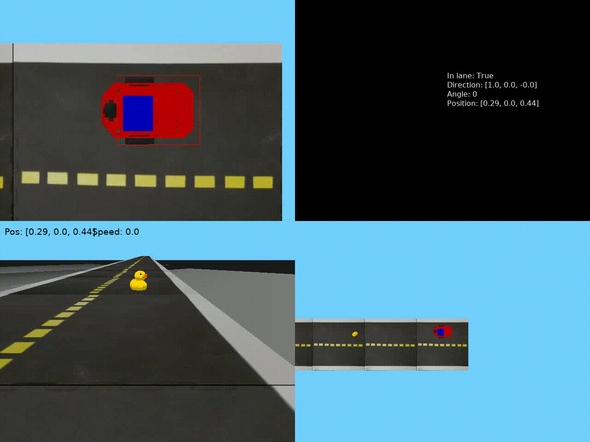

# Домашнее задание 3
## Часть 1
Выполнить остановку перед уточкой.
Решение находится в файле ```item_1.py```

[Сcылка](https://github.com/OSLL/aido-auto-feedback/tree/bd94ce2f0ebbdbe5bdf95ff7e0e4ea6d272cc65486a0e363ae92d462) на 
лог решения.

Визуализация


## Часть 2 ссылка
Объехать уточку. Решение находится в файле ```item_2.py```

[Ссылка](https://github.com/OSLL/aido-auto-feedback/tree/d4b8e486a0cf44f2268d2c5ddcc43d8fe0bdb4fae13b468f5b759ed4) на 
лог решения.

Визуализация

